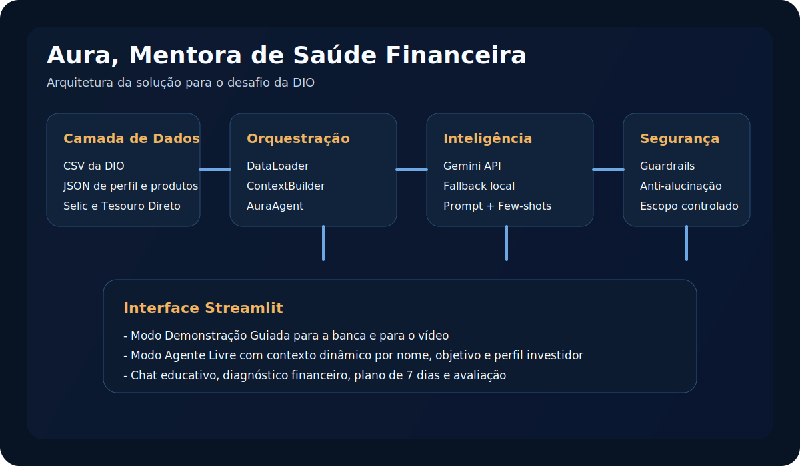

# Aura, Mentora de Saúde Financeira

Aplicação desenvolvida para o desafio da DIO "Construa seu Assistente Virtual com Inteligência Artificial".

Aura é uma mentora digital de saúde financeira para iniciantes no Brasil. Ela não vende promessa, não recomenda investimento direto e não inventa contexto: organiza dados, explica conceitos e sugere próximos passos educativos com base em fontes confiáveis.

## Visão do projeto

[Acessar app no Streamlit](https://aura-mentora-de-saude-financeira.streamlit.app/)




## O que faz este projeto chamar atenção

- Interface Streamlit com cara de produto, não apenas demo técnica
- Diagnóstico financeiro real a partir dos dados mockados da DIO
- Dois modos de uso: demonstração guiada e agente livre com contexto personalizável
- Plano educativo de 7 dias para transformar resposta em ação
- Configuração de provedor com chave via interface para testes locais e em produção
- Badge visual que mostra o modo real da resposta, evitando confusão entre Gemini, OpenAI e fallback local
- Guardrails explícitos para segurança e anti-alucinação
- Integração com Gemini API via Google AI Studio e suporte opcional a OpenAI
- Enriquecimento com fontes oficiais do Banco Central e do Tesouro Direto

## O que o avaliador consegue ver na prática

- um modo de demonstração guiada, ideal para o vídeo e para a banca;
- um modo de agente livre com contexto dinâmico por nome, renda, objetivo e perfil investidor;
- seleção explícita do provedor de IA com feedback visual do modo realmente utilizado;
- respostas diferentes conforme a persona selecionada;
- guardrails claros para escopo, recomendação proibida e dados sensíveis;
- documentação, testes e assets visuais prontos para portfólio.

## Objetivo do projeto

Construir uma mentora digital de saúde financeira capaz de transformar dados em clareza, diagnóstico e educação financeira personalizada para iniciantes no Brasil, com respostas seguras, coerentes e rastreáveis.

## O que foi utilizado para desenvolver

- Python 3.12
- Streamlit para interface e experiência navegável
- Gemini API via Google AI Studio como provedor principal
- SDK oficial `google-genai` como integração preferencial do Gemini
- OpenAI como opcional e fallback de integração
- Pandas para leitura e tratamento dos dados
- Requests para consumo das fontes oficiais
- Python Dotenv para configuração segura de ambiente
- Pytest para testes automatizados
- Ruff para qualidade e padronização do código

## Por que Gemini foi escolhido

- opção gratuita mais aderente para a fase atual do projeto;
- fluxo simples de chave via Google AI Studio;
- boa qualidade para respostas educativas;
- integração compatível com o SDK oficial do ecossistema Gemini;
- suficiente para demonstrar engenharia de prompt, segurança e contexto sem elevar custo da entrega.

## Escopo da Aura

### Faz
- explica conceitos financeiros com linguagem simples;
- resume padrão de gastos e saldo do período;
- contextualiza a reserva de emergência;
- compara produtos financeiros de forma educativa;
- usa o perfil do cliente para adequar o tom e a profundidade;
- mostra as referências usadas sempre que possível.

### Modos de experiência
- Demonstração guiada: cenário pronto para apresentar o desafio com dados consistentes da DIO.
- Agente livre: contexto personalizável para conversar como um agente educacional, sem ficar preso ao perfil fixo do João. Campos como nome, idade e objetivo podem ser preenchidos livremente pelo usuário.

### Não faz
- não recomenda compra de ativo ou produto específico;
- não promete rentabilidade;
- não responde com dado inventado;
- não acessa ou compartilha informações sensíveis;
- não substitui assessor ou planejador financeiro certificado.

## Fontes utilizadas

- Base local da DIO:
  - `data/transacoes.csv`
  - `data/historico_atendimento.csv`
  - `data/perfil_investidor.json`
  - `data/produtos_financeiros.json`
- Selic oficial do Banco Central:
  - https://dadosabertos.bcb.gov.br/dataset/11-taxa-de-juros---selic
- Produtos do Tesouro Direto:
  - https://www.tesourodireto.com.br/produtos/nossos-produtos

## Arquitetura

```text
.
|-- assets/
|-- data/
|-- docs/
|   |-- 01-documentacao-agente.md
|   |-- 02-base-conhecimento.md
|   |-- 03-prompts.md
|   |-- 04-metricas.md
|   |-- 05-pitch.md
|   `-- 06-evidencias.md
|-- src/
|   |-- app.py
|   |-- prompts/
|   |   |-- few_shots.txt
|   |   `-- system_prompt.txt
|   `-- services/
|       |-- agent.py
|       |-- context_builder.py
|       |-- data_loader.py
|       |-- external_sources.py
|       |-- finance_analyzer.py
|       `-- safety.py
|-- tests/
|-- .env.example
|-- .gitignore
|-- main.py
|-- pyproject.toml
|-- pytest.ini
`-- requirements.txt
```

## Como executar

### 1. Criar e ativar ambiente virtual

Windows PowerShell:

```powershell
python -m venv .venv
.\.venv\Scripts\Activate.ps1
```

Linux/macOS:

```bash
python3 -m venv .venv
source .venv/bin/activate
```

### 2. Instalar dependências

```bash
python -m pip install --upgrade pip
python -m pip install -r requirements.txt
```

### 3. Configurar API

Opção recomendada e gratuita: Gemini via Google AI Studio.

Crie um arquivo `.env` a partir de `.env.example`:

```bash
cp .env.example .env
```

No Windows PowerShell, você também pode usar:

```powershell
Copy-Item .env.example .env
```

Depois, preencha o arquivo com este bloco:

```bash
GEMINI_API_KEY=sua_chave_aqui
AURA_PROVIDER=gemini
AURA_MODEL=gemini-2.5-flash
```

Se preferir, você também pode abrir o app e inserir a chave diretamente no campo `Gemini API Key` da barra lateral. Isso é útil em produção, quando não existe acesso direto ao arquivo `.env`.

Se quiser manter o `.env` igual ao modelo completo do projeto:

```bash
GEMINI_API_KEY=
OPENAI_API_KEY=
AURA_PROVIDER=gemini
AURA_MODEL=gemini-2.5-flash
```

Se quiser usar OpenAI em vez de Gemini:

```bash
OPENAI_API_KEY=sua_chave_aqui
AURA_PROVIDER=openai
AURA_MODEL=gpt-5-mini
```

### 4. Rodar a aplicação

```bash
streamlit run src/app.py
```

App publicado:

https://aura-mentora-de-saude-financeira.streamlit.app/

## Modos de execução

- Com `GEMINI_API_KEY` no `.env` ou digitada na interface: respostas geradas pela Gemini API via Google AI Studio
- Com `OPENAI_API_KEY`: respostas geradas pela OpenAI API com contexto estruturado
- Sem chave de API: fallback local com diagnósticos e respostas determinísticas

O app mostra um badge com o modo real da resposta:

- `Gemini ativo` quando a resposta veio da Gemini;
- `OpenAI ativa` quando a resposta veio da OpenAI;
- `Modo local ativo` quando não houve uso de provedor externo;
- `Aguardando resposta` antes da primeira execução no modo Gemini.

Isso é ótimo para demo, porque o projeto continua funcional mesmo sem acesso imediato à API.

## Evolução dos prompts

O projeto não ficou preso em um prompt único e estático. A estratégia adotada foi iterativa:

- começar pelas regras fundamentais do agente;
- adicionar exemplos few-shot para reduzir ambiguidade;
- documentar casos extremos para fora de escopo, dado sensível e recomendação proibida;
- reforçar o uso exclusivo de dados confiáveis;
- estruturar o prompt com delimitadores claros para missão, regras, tom e formato de resposta;
- mover parte da segurança para uma camada de guardrails fora do modelo.

Essa evolução está descrita em [docs/03-prompts.md](./docs/03-prompts.md).

## Arquivos oficiais adicionados em `data/`

- `data/selic_bacen.json`: snapshot da série oficial da Selic
- `data/tesouro_direto_produtos.json`: snapshot estruturado dos produtos do Tesouro Direto

## Como testar

```bash
python -m pytest
```

## Como validar qualidade

```bash
python -m ruff check .
```

## Ajustes recomendados no GitHub

Depois dessas evoluções, vale refletir isso no repositório remoto também:

- atualizar a descrição curta do projeto no GitHub com foco em "mentora de saúde financeira com IA, guardrails e fontes oficiais";
- subir screenshots reais da interface em uso, além dos SVGs conceituais;
- fixar este projeto no perfil, já que ele agora comunica melhor produto, engenharia e documentação;
- considerar criar uma release inicial ou tag de entrega do desafio, para marcar esta versão mais madura.

## Perguntas para demonstração

- Onde estou gastando mais?
- Como está minha reserva de emergência?
- O que é Selic?
- Me explique Tesouro Selic
- Qual investimento eu devo comprar hoje?
- Como está o clima na cidade de Natal/RN?

## Sugestão de capturas para o GitHub

- tela inicial da Aura no modo `Demonstração guiada`
- troca para `Agente livre` com nome e perfil personalizados
- comparação entre resposta `conservadora` e `arrojada`
- pergunta fora de escopo caindo em `guardrail`

## Documentação do desafio

- [Documentação do agente](./docs/01-documentacao-agente.md)
- [Base de conhecimento](./docs/02-base-conhecimento.md)
- [Prompts](./docs/03-prompts.md)
- [Métricas](./docs/04-metricas.md)
- [Pitch](./docs/05-pitch.md)
- [Evidências de testes](./docs/06-evidencias.md)

## Autor

- Diego Pablo de Menezes
- LinkedIn: https://www.linkedin.com/in/diego-pablo/
- GitHub: https://github.com/DiegoPablo2021/
- Portfolio: https://diego-pablo.vercel.app/
