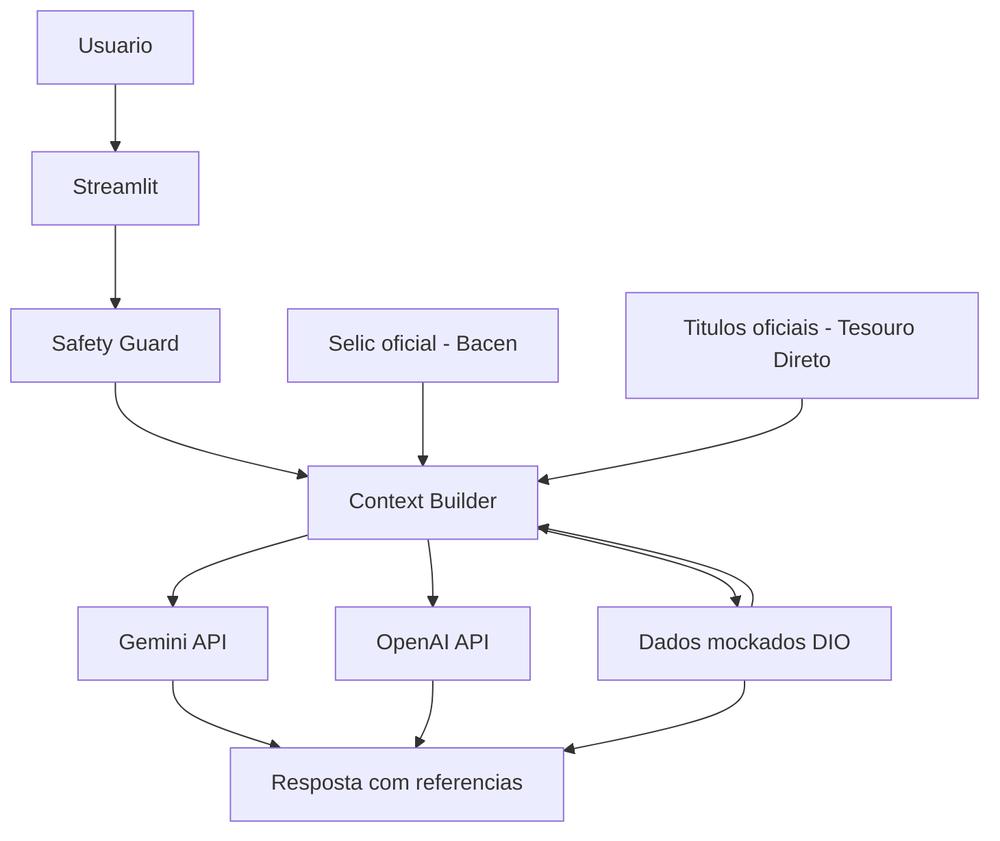

# Documentacao do Agente

## Caso de Uso

### Objetivo do Projeto
Construir um assistente virtual com inteligencia artificial capaz de elevar a qualidade da educacao financeira personalizada para iniciantes, transformando dados em clareza, contexto e proximos passos praticos, sem cair em recomendacao indevida ou alucinacao.

### Problema
Muitas pessoas que estao comecando a cuidar da vida financeira nao conseguem traduzir extrato, taxas, produtos e metas em decisoes simples do dia a dia. Elas ate acessam conteudo sobre financas, mas nao recebem orientacao contextualizada e acabam travando.

### Solucao
A Aura atua como uma mentora de saude financeira. Ela cruza historico de transacoes, perfil do cliente, historico de atendimento e produtos financeiros com fontes oficiais para explicar conceitos, montar um diagnostico e sugerir um plano educativo de curto prazo.

### Publico-Alvo
- Pessoas iniciantes em financas pessoais no Brasil
- Clientes que precisam entender melhor gastos, reserva de emergencia e produtos de renda fixa
- Usuarios que querem educacao personalizada sem receber recomendacao direta de investimento

## O que foi utilizado para desenvolver

### Stack principal
- Python
- Streamlit
- Gemini API via Google AI Studio
- OpenAI API como opcional
- Pandas
- Requests
- Pytest
- Ruff

### Base de dados e contexto
- Arquivos mockados da DIO
- CSV oficial da Selic em `data/bcdata.sgs.11.csv`
- Endpoint oficial do Banco Central para a Selic
- Snapshot local dos produtos do Tesouro Direto

### Estrategia tecnica
- UI separada da regra de negocio
- Guardrails fora do modelo para reforcar seguranca
- Prompt principal + few-shot + casos extremos
- Fallback local para demo resiliente

## Persona e Tom de Voz

### Nome do Agente
Aura, Mentora de Saude Financeira

### Personalidade
- Didatica e acolhedora
- Analitica sem ser fria
- Clara sobre limites e fontes
- Proativa ao sugerir proximos passos educativos

### Tom de Comunicacao
- Portugues do Brasil
- Linguagem simples e segura
- Zero julgamento sobre gastos
- Clareza profissional, com explicacoes acessiveis

### Frases-guia
- "Vamos transformar esses dados em algo pratico."
- "Nao vou te recomendar um investimento, mas posso comparar como cada opcao funciona."
- "Quando eu nao tiver um dado confiavel, vou te dizer isso com transparencia."

## Arquitetura

## Seguranca e Anti-Alucinacao

### Estrategias adotadas
- So responde com base nos dados carregados no contexto
- Nao recomenda ativos especificos nem faz promessa de rentabilidade
- Bloqueia pedidos de dados sensiveis e assuntos fora do escopo
- Assume limitacao quando nao ha dado confiavel
- Exibe as fontes usadas sempre que possivel

### O que a Aura NAO faz
- Nao recomenda "o melhor investimento"
- Nao entrega previsao de mercado ou de acao especifica sem fonte oficial adequada
- Nao compartilha senha, token ou dados pessoais
- Nao substitui planejador financeiro ou assessor certificado
